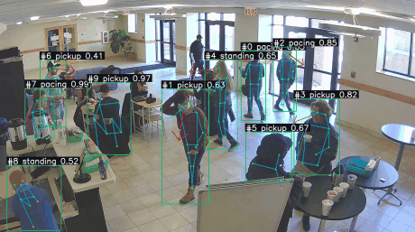
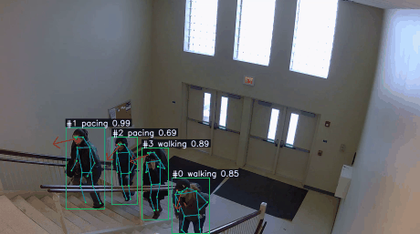

# motion-triage

Real-time human-motion analysis as a standalone service. **Pixels in,
behavioral verdicts out** — `detect → track → pose → behavior`.

Runs as its own process behind a thin API, so it can power a closed product
without entangling it: the caller speaks HTTP/gRPC and never links the model
code. That process boundary is deliberate — it's what keeps copyleft on this
side of the wire.

## See it work

Every person is detected, tracked across frames, given a 17-keypoint skeleton,
and flagged with a behavior — plus a red arrow showing head-facing direction.
All overlays are the real pipeline output, drawn frame by frame.

**Multi-person behavior flags + head direction** — one busy scene, every body
tracked and classified at once:



**Clean tracking through a wide outdoor view:**



> Demo footage is from the **MEVA** dataset (Kitware / IARPA, CC BY 4.0 —
> consented actors). No customer or private footage ever appears here; that's
> the privacy boundary, enforced in [`.gitignore`](.gitignore).

## What it does

Given a short sequence of frames from a single camera, motion-triage:

1. **Detects** people and vehicles per frame (YOLO).
2. **Tracks** them across frames (IoU tracker, tolerant to short gaps / occlusion).
3. **Estimates pose** — 17-keypoint COCO skeletons per person (YOLO-pose).
4. **Classifies behavior** from each skeleton's trajectory and returns the flags
   below, plus an `ALERT` / `DISMISS` decision with a reason.

It is camera-geometry aware (operator-drawn zones / lines) and perspective-aware:
motion is measured in the subject's own body-lengths, not raw pixels, so a
distant walker and a near loiterer are never confused.

## Behavior flags

The NN's job is to describe **what a body is doing**, in under a millisecond, so
the alert decision becomes a cheap rule (`flag × zone × hour`) instead of a slow
model call. Flags graduate from *experimental* to *validated* only after they
beat the per-class accuracy gate.

| flag | source of labels | status |
|------|------------------|--------|
| walking | displacement + real corpus | ✅ validated (F1 ≈ 0.90) |
| standing | displacement + real corpus | ✅ validated (F1 ≈ 0.77) |
| pacing | movement-without-travel band | ✅ validated (F1 ≈ 0.58) |
| pickup / set-down | MEVA KPF annotations | 🧪 experimental |
| door interaction | MEVA KPF + operator zones | 🧪 experimental |
| carrying | MEVA KPF annotations | 🔬 research — needs object detection¹ |

¹ Carrying is nearly indistinguishable from walking on the skeleton alone — you
have to *see* the object. It's the worked example of where pose ends and
detection begins; the fix is an "object-near-hands" feature from the detector,
not more pose data.

Composition is the whole point: `pacing` is benign at a storefront at noon and
an alert at 3 a.m.; `pickup` inside a package zone is theft-shaped, on a loading
dock it's a job. The NN supplies the verb; zones and hours supply the meaning.

## Architecture

```
frames ─▶ detect ─▶ track ─▶ pose ─▶ behavior ─▶ { decision, reason, tracks[] }
          (YOLO)    (IoU)   (YOLO-pose) (rules → temporal-conv NN)
```

The behavior layer ships in two stages, same API for both:

- **heuristics:** hand-crafted keypoint features (hip vertical velocity,
  posture-height ratio, arm-extension, stride regularity, head direction) feeding
  a rule engine. No training data required; the sanity baseline forever.
- **learned:** a small temporal conv net over `[T=16, V=17, C=6]` skeleton
  sequences. If it can't beat the heuristics on the held-out gate, it isn't
  trained yet — and it doesn't ship.

## The pipeline, end to end

```bash
# 1. any folder of short clips → pose-track corpus (GPU: --device 0)
python training/clips_to_corpus.py --clips data/clips/mine --out data/corpus.jsonl --device 0

# 2. label: heuristic prelabels for the easy classes...
python training/prelabel.py --corpus data/corpus.jsonl --out data/labels.csv
#    ...and authoritative labels from MEVA's own activity annotations:
python training/meva_labels.py --corpus data/corpus.jsonl --out data/labels_meva.csv

# 3. train → ONNX + sidecars (numpy/MLX weight sidecar written too)
python training/train.py --corpus data/corpus.jsonl --labels-csv data/labels.csv \
    --out models/behavior.onnx --device cuda

# 4. SEE it: annotated video + a README-ready GIF
python training/render_demo.py --clip data/clips/mine/x.mp4 --model models/behavior.onnx \
    --out demo.mp4 --gif docs/demos/vX_scene.gif
```

Inference runs three ways from one trained model: **Rust/ort** (ONNX; CoreML on
macOS, CPU elsewhere — the production path), pure **numpy** (anywhere), or **MLX**
(Apple-silicon GPU). All cross-verified per-sample (`training/infer_mlx.py`).

## Versioned demos

Every iteration drops a demo GIF under [`docs/demos/`](docs/demos/), named
`v<major.minor>_<scene>.gif`, so the repo's history shows the model getting
better over time. The tier numbers track **capability**, not a model binary:

| tier | demo | capability shown |
|------|------|------------------|
| v0.1 | `v0.1_walking_tracked.gif` | detect → track → pose → the validated core flags (walking / standing / pacing) |
| v0.2 | `v0.2_multiflag_cafeteria.gif` | many people at once, head-direction arrows, and the experimental MEVA-trained flags (pickup / door / carrying) — not yet gate-passed |

## The contract

[`docs/API.md`](docs/API.md) is the only thing callers depend on. Detector, pose
model, language, and behavior model can all change behind it without any caller
noticing. A gRPC mirror lives in [`proto/motion.proto`](proto/motion.proto).

## Why it exists

Every ingredient is open — YOLO, YOLO-pose, ST-GCN. The *assembled, deployable*
service — one that runs unattended on real outdoor CCTV and emits trustworthy
behavior verdicts — is not. Commercial platforms (Ambient.ai, Spot AI, Verkada)
keep it closed; research repos stop at benchmark numbers or frontal-webcam demos
their own authors warn don't survive the real world. This is the missing middle.

The hard part was never the models. It's the unglamorous engineering: tracking
through occlusion, pose quality at 30+ ft on a 2 MP night-mode sensor, ID
switches when two people cross, not crying wolf at 3 a.m. — and the discipline of
a gate that refuses to ship a flag that hasn't earned it.

## Data & privacy

- **Training data and footage never enter this repo** — `data/` and `models/`
  are gitignored; only curated MEVA demos live under `docs/demos/`.
- Skeleton sequences are stored without identity — action classification, not
  gait recognition. See [`docs/DATA_PLAYBOOK.md`](docs/DATA_PLAYBOOK.md).
- Commercial-licensed training corpora (MEVA, VIRAT CC BY 4.0) carry attribution;
  research-only sets (UCF-Crime, NTU) are used for evaluation only, never training.

## License

AGPL-3.0. The detection layer wraps Ultralytics YOLO (AGPL), so the whole service
inherits it. Callers that talk to it across a process boundary (HTTP / gRPC) are
**not** derivative works and carry no AGPL obligation — that boundary is the
entire point of shipping this as a service. Swap the detector for a permissive one
(RTMDet / D-FINE / RF-DETR) and this can be relicensed Apache-2.0. Full text in
[LICENSE](LICENSE).
